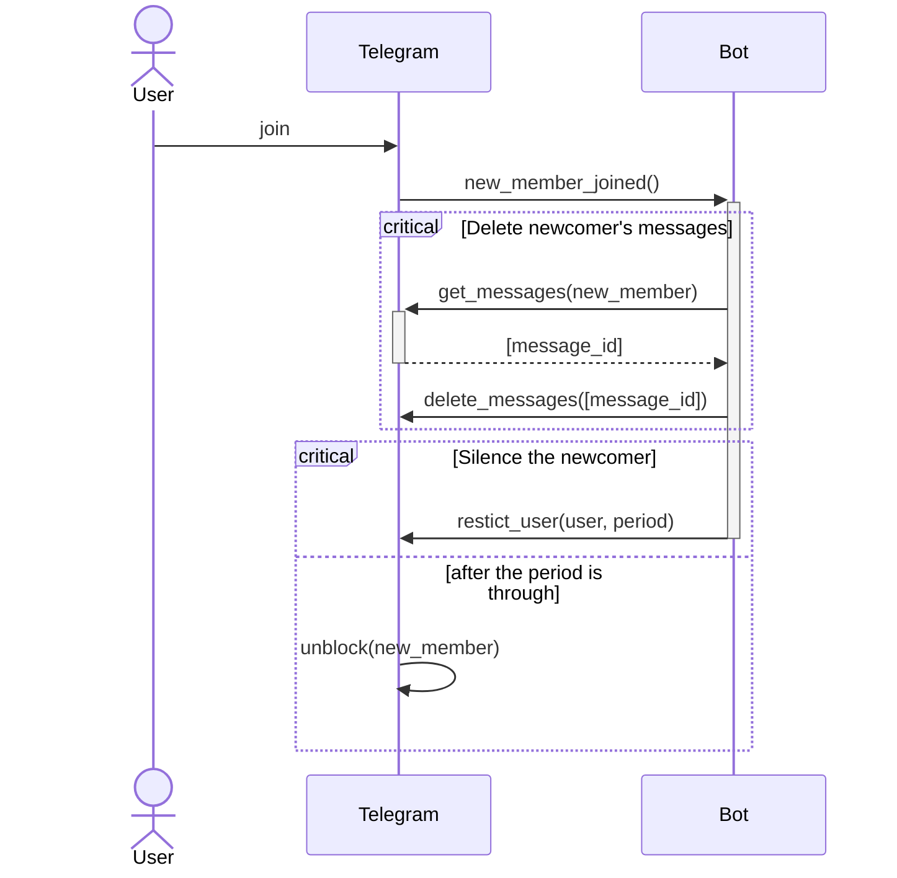
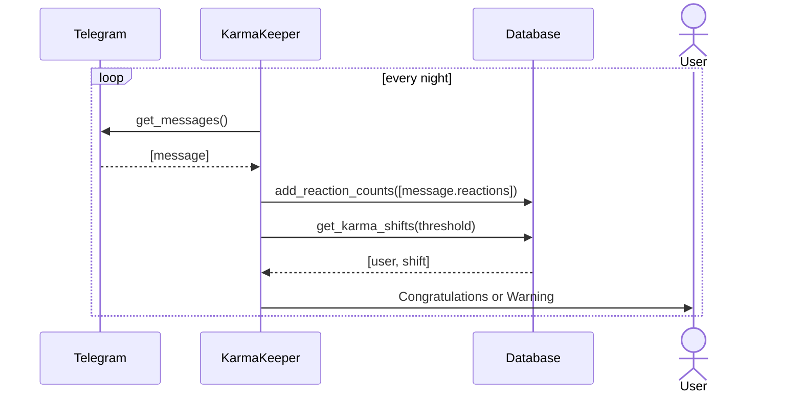

# How the bot works

As a result, the newcomer can't send new messages for a specified period of time. Although he can read and sees the pinned button "Newcomer? Here!"

# Calculate karma every night

